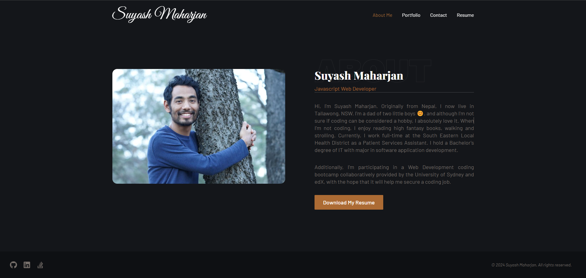

 [](https://nodejs.org/en) [](https://www.npmjs.com/) [](https://react.dev/)  [](https://tailwindcss.com/) [](https://react.dev/)

<div align="right"> 
<a href= "http://www.wtfpl.net/about/"></a>
</div>

# My React Portfolio  

This project is a personal portfolio webpage that showcases my bio, recent works, and contact information. It is built using React and provides a single-page experience for visitors to learn more about me and my skills. The portfolio includes sections for projects, skills, and a contact form for potential collaborations or inquiries.

##  Description

The project is a personal portfolio webpage built using React. It showcases the my bio, recent works, and contact information. The portfolio provides a single-page experience for visitors to learn more about me and tmy skills. It includes sections for projects, skills, and a contact form for potential collaborations or inquiries.

By building this project, I gained experience in React development, including creating components, managing state, and handling user interactions. I also learnt how to structure a single-page application and incorporate different sections and features. Additionally, I have learnt about styling and layout using CSS or a CSS framework.

Overall, building this project provided me with practical experience in React development and web design, as well as an opportunity to showcase my skills and projects to potential clients or employers.

## Table of Contents

1. [Installation](#installation)
1. [Usage](#usage)
1. [Licence](#licence)
1. [Screenshots](#screenshots)
1. [Live Site Link](#live-site-link)


## Installation 

1. Download and Install the `Node.js` 
2. Initialize the project 
    ```       
    npm init -y
    ```
3. Install `React` library
    ```
    npm i react
    ```
4. Install `react dom` plugin
    ```
    npm i react-dom
    ```
5. Install `react router dom` plugin
    ```
    npm i react-router-dom
    ```
7. Install `@Emailjs/browser` 
    ```
    npm i @emailjs/browser
    ```
8. Following are the dev dependencies:
    - Install `@heroicons/react` for beautiful hand-crafted SVG icons, by the makers of Tailwind CSS
        ```
        npm i -D @heroicons/react
        ```
    - Install `@types/react` 
        ```
        npm i -D @types/react
        ```
    - Install `@types/react-dom` 
        ```
        npm i -D @types/react-dom
        ```
    - Install `@vitejs/plugin-react` 
        ```
        npm i -D @vitejs/plugin-react
        ```
    - Install `autoprefixer` 
        ```
        npm i -D autoprefixer
        ```
    - Install `eslint` 
        ```
        npm i -D eslint
        ```
    - Install `eslint-plugin-react` 
        ```
        npm i -D eslint-plugin-react
        ```
    - Install `eslint-plugin-react-hooks` 
        ```
        npm i -D eslint-plugin-react-hooks
        ```
    - Install `eslint-plugin-react-refresh` 
        ```
        npm i -D eslint-plugin-react-refresh
        ```
    - Install `framer-motion` -a simple and powerful JavaScript animation library
        ```
        npm i -D framer-motion
        ```
    - Install `postcss` 
        ```
        npm i -D postcss
        ```
    - Install `react-icons` 
        ```
        npm i -D react-icons
        ```
    - Install `react-scroll` 
        ```
        npm i -D react-scroll
        ```
    - Install `tailwindcss` 
        ```
        npm i -D tailwindcss
        ```
    - Install `vite` 
        ```
        npm i -D vite
        ```

## Usage

If you wish to use this repo,
- Get a copy of this repo to your local machine
- Install the node module in the root directory
    ```
    npm i
    ```
- Again, navigate to root directory, type the following to open in development mode
    ```
    npm run dev
    ```
    Now it should open my portfolio webpage


## Licence

This app is licensed under [**WTFPL**](http://www.wtfpl.net/about/)

## Screenshots

Screenshot showing the get all users endpoint 



## Live Site Link

[Deployed on Netlify](https://simplesuyash-portfolio.netlify.app/)


